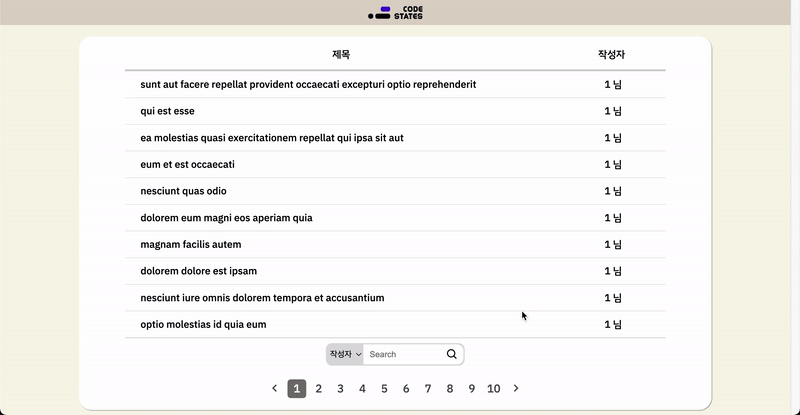
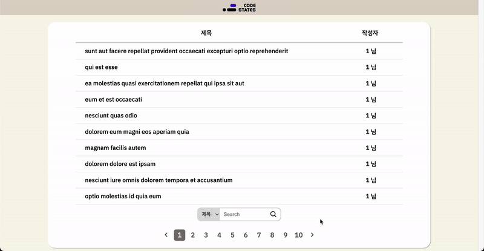
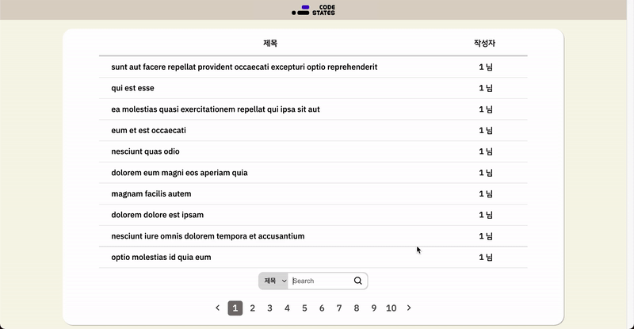
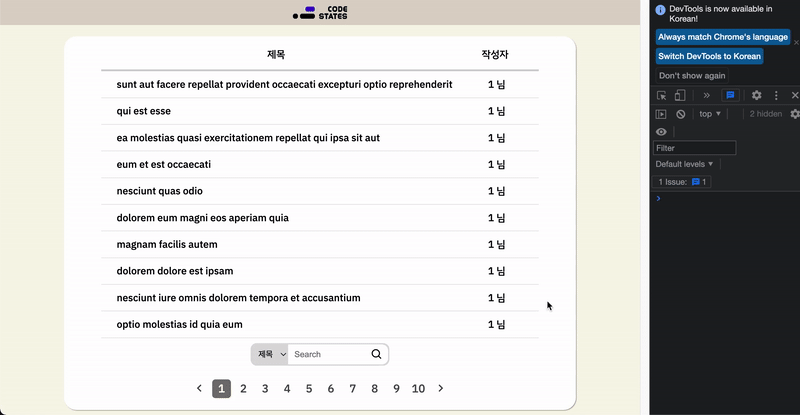
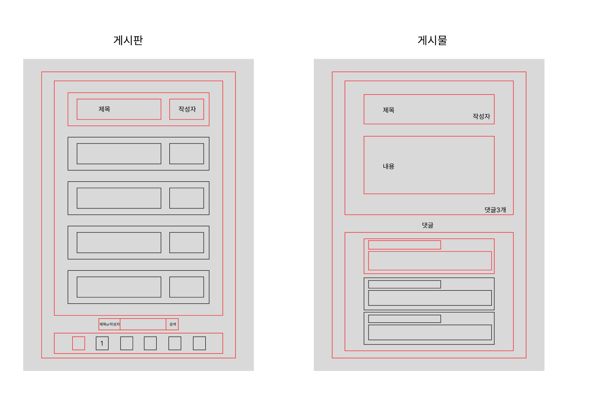

# codestates-fe-advanced-course

## 배포 링크
https://yunho7058.github.io/

## 구현 이미지
* 게시물, 댓글 렌더링

* 게시물 페이지네이션 기능

* 게시물 검색 기능

* 반응형 웹

## 프로젝트 실행 방법
1. 해당 레파지토리 url 복사 후 터미널에 `git clone 복사한url`
2. client 파일 접근 (터미널 경로 확인) 명령어 `cd client` 
3. 터미널에 `npm install` 입력 (모든 패키지 다운로드)
4. 터미널에 `npm start` 입력 후 웹 이용

## 사용 스텍

     
   
  
  
  

## 구현한 기능 목록
### Bare Minimum
* 게시물 리스트와 게시물 상세 페이지
  * ✅ 게시물 리스트는 게시판 형태로 구성합니다.
  * ✅ 각 게시물 상세 페이지에는 댓글 수가 표기되고 게시물 내용의 하단에 댓글이 나열됩니다.
  
 ### Additional features
 * 게시물 리스트 페이지네이션 기능 구현
 * 게시물 검색 기능 구현
 * 반응형 Web 구현(폰트,크기)
 

 
 ## 구현 방법 혹은 구현하면서 어려웠던 점
 * 초기 설정
    * 사용 스텍 정하기 : 많은 데이타를 관리하지 않기때문에 따로 상태라이브러리를 사용하지 않고 React-Hooks 사용   
    * 디렉토리 구조  : 리액트의 많은 컴포넌트를 재사용 및 유지보수를 하기위해 컴포넌트를 나눠관리하면 더욱더 효울적으로 관리할수있다. 공식문서에서 정해져있는 구조는 없다고 한다, 일반적인 방식은 있으나 개인이나 회사에 맞춰 구조를 짜면 될것같다. 아래는 내가 구성한 폴더와 컴포넌트 구조이다.
        > 📁 src 
        > > 📁 assets
        > > > 🖼 사용이미지
        > > > 
        > > 📁 components
        > > > 📄 Headers.js
        > > > 
        > > 📁 page
        > > > 📄 Post.js
        > > > 📄 PostList.js
        > > 
        > > 📁 util
        > > > 📄 Spinner.js
        > > 
        > > 📄 App.js
        > > 
        > > 📄 index.js
    * 동적 라우팅 : `<Route path="/:id" element={<Post />} />` 게시물 리스트에서 해당 게시물 클릭하여 해당아이디 url 접속, 게시물 접속 후 useParams 를 사용하여  해당 게시물 정보(JSON Placeholder API 요청) 불러오도록 작성하였습니다.
  
## Wireframe
https://www.figma.com/file/7fVTbytHbxCf4pt3TnF7FX/Untitled

Figma 툴을 사용해 간단한 Wireframe 작성

## 성능 최적화 개선 방법

## 추가 구현 방법
* 게시물 리스트 페이지네이션
  > 간략설명 : JSON Placeholder API에서 파라미터 단위로 데이터 갯수를 제한한 요청은 지원되지 않아 전체 게시물을 10개 단위로 slice 하여 state 저장후 랜더링되게 구현하였습니다.
  > * JSON Placeholder API에서 게시물 요청 하여  `allPost`(state) 100개의 게시물 저장
  > * 초기 설정을 위해 useEffect를 사용하여 `allPost` 변경 될때 전체 게시물을 10개로 slice 하여 `posts`(UI 보이는 state) 저장 후 랜더링
  > * ` useEffect(() => {
    setPosts(allPosts.slice(0, 10));
  }, [allPosts]);`
  * 페이지네이션 동작
    > 간략설명 : 보여줄 게시물`posts`길이에 따른 버튼 생성
    > * `posts`길이를 10으로 나누고 `Math.ceil()`함수를 사용하여 표시될 가장큰 버튼 번호 생성
    > * `new Array(위에서 구한 수).fill(0)`를 사용 후 `map()`으로 페이지네이션 버튼 생성
    > * `paginationNum` state 생성 후 페이지네이션 버튼 클릭시 그 해당번호 저장 `setPaginationNum(해당번호)`
    > * useEffect 생성 하여 `paginationNum` 변경시 마다 실행
    > * `paginationNum` 변경 시 클릭한 해당수(`paginationNum`) 10을 곱하고 다시 게시물 랜더링을 위해 `posts`의 전체게시물 or 필터된 게시물 slice 하여 저장     
    > `  useEffect(() => {
    let num = paginationNum * 10;
    setPosts(filterPostsData.slice(num - 10, num));
  }, [paginationNum]);`     
* 게시물 검색 기능
  > 간략설명 : 찾고자하는 단어를 전체게시물`allPost`에 `filter()`와 `includes()` 함수를 사용하여 필터된 게시물 `posts`저장 후 렌더링되게 구현하였습니다.
  > * 사용자가 입력한 찾고자 하는 단어 `searchValue`(state) 입력
  > * 전체 게시물`allPost`에서 `searchValue`를 `filter()`와 `includes()` 사용하여 전체 게시물 제목 = `selectValue` 필터
  > * 필터된 데이타 `posts` 저장 후 랜더링
* JSON Placeholder API 요청 후 데이터 로딩시 스피너 랜더링 기능
  > 간략설명 : Spinner.js에 Spinner 커스텀 후 사용하고자 하는 component로 import 후 `isSpinner`(state) Boolean 값을 사용하여 데이터 요청 전 랜더링, 요청 후 게시물 랜더링되게 구현하였습니다. 
* 반응형 웹 구현
  > 간략설명 : Media Query를 사용하여 width 조건에 따른 반응형 웹 구현하였습니다.
  > 추가로 Media 크기에 따라 컴포넌트 하나하나에  Media Query를 사용하여 구현하니 많은 번거로운이 있었다. 추후에는 react-responsive 라이브러리의 useMediaQuery를 사용하여 Media 크기에 따른 변수를 설정하고 컴포넌트로 변수로 넘겨주면 간편하게 구현할 수 있을것같다.
